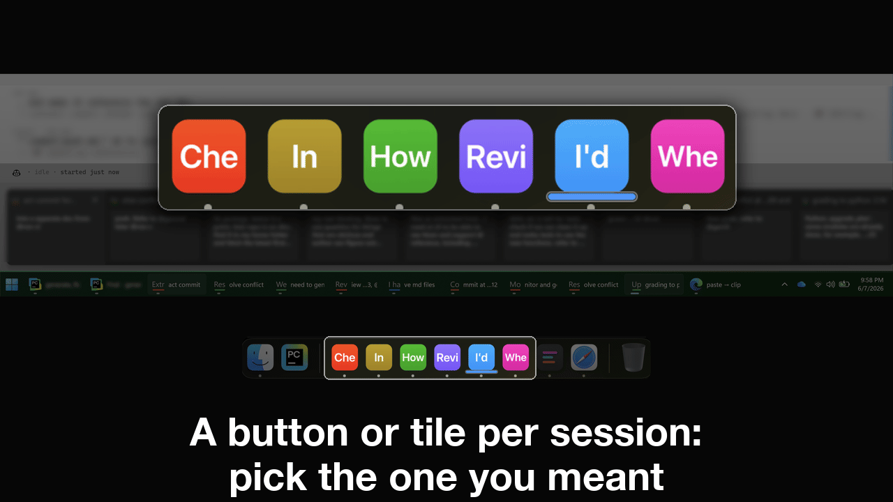
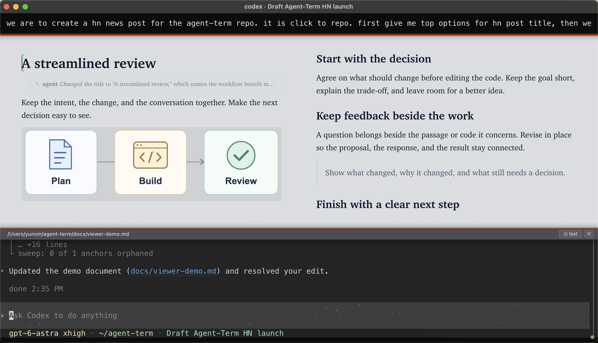

<a name="agentterm"></a>
<a name="agentterm-a-terminal-built-for-coding-agents"></a>
<a name="agentterm-a-super-terminal-for-coding-agents"></a>

# AgentTerm: A super terminal for you and your coding agents

**From telling sessions apart to finishing projects.**

<a id="demo"></a>

*The demo plays automatically; the first frame may take a moment.*



*Each frame at full size:* [Sessions 1](https://raw.githubusercontent.com/albertwujj/agent-term/main/docs/assets/frames/sessions-1.png) · [Sessions 2](https://raw.githubusercontent.com/albertwujj/agent-term/main/docs/assets/frames/sessions-2.png) · [Resume](https://raw.githubusercontent.com/albertwujj/agent-term/main/docs/assets/frames/resume.png) · [Comment](https://raw.githubusercontent.com/albertwujj/agent-term/main/docs/assets/frames/comment.png) · [Docs 1](https://raw.githubusercontent.com/albertwujj/agent-term/main/docs/assets/frames/docs-1.png) · [Docs 2](https://raw.githubusercontent.com/albertwujj/agent-term/main/docs/assets/frames/docs-2.png) · [Docs 3](https://raw.githubusercontent.com/albertwujj/agent-term/main/docs/assets/frames/docs-3.png) · [Code 1](https://raw.githubusercontent.com/albertwujj/agent-term/main/docs/assets/frames/code-1.png) · [Code 2](https://raw.githubusercontent.com/albertwujj/agent-term/main/docs/assets/frames/code-2.png) · [Code 3](https://raw.githubusercontent.com/albertwujj/agent-term/main/docs/assets/frames/code-3.png) · [Phone 1](https://raw.githubusercontent.com/albertwujj/agent-term/main/docs/assets/frames/phone-1.png) · [Phone 2](https://raw.githubusercontent.com/albertwujj/agent-term/main/docs/assets/frames/phone-2.png).

*Drill deeper into each example:* [Switch sessions](docs/sessions.md#switch-to-the-right-running-session) · [Resume](docs/sessions.md#find-and-resume-sessions) · [Comment](docs/comment.md) · [Docs](docs/plan.md) · [Code](docs/review.md) · [Phone](docs/phone.md).

<a name="quick-start"></a>

**Quick start:** ask your agent. macOS, or Windows through WSL.

Copy this prompt:

```text
Clone https://github.com/albertwujj/agent-term to ~/agent-term, then set it
up and launch it for my current project, following the basic setup in its
docs/setup.md.
```

Read [docs/setup.md](docs/setup.md), the reference in the prompt above.

Once a window opens, [resume your previous session](docs/sessions.md#resume-an-existing-cli-session) or [start a new one](docs/sessions.md#start-an-agent), and work as usual. When you want to give precise feedback or ask a question, [select and enter a comment](docs/comment.md).

## Why extend the terminal

If you are a terminal fan and want to get straight to it, skip ahead to [what AgentTerm adds](#whats-added-so-far).

People run coding agents in an IDE, in the terminal, or in the vendor's desktop app. The terminal keeps pulling them in: Claude Code and Codex shipped as terminal programs, and Cursor and Copilot, born in the IDE, added CLIs of their own. A form from decades ago turned out to have what an agent needs: text in, text out, and your shell, git, and every other tool one command away.

So why do people still run agents in the IDE, and why are the vendors adding their agents to desktop apps? Partly because the standard terminal interface (TUI), great for text-centric iteration, cannot offer agents and users the essentials and the boosts a richer interface can. One answer is to move the agent out, into an app built around it. The other is to treat the terminal as the core and extend it. This repo is the second path: a full terminal wrapped in a modern extensible window (Electron), retaining everything you already have and raising the ceiling.

Extending it on demand is what keeps it a terminal. Additions come in only when you need them, and the window is a terminal again the moment you finish. An IDE or a vendor's desktop app has its panels up before you type, which can distract. Here the window is your session alone, shaped only by the work you do in it, and full screen if you like, with nothing else in view ([one OS window per session](#one-os-window-per-session)).

<p align="center">

<br><strong>Work on a document right in the terminal.</strong> The document area expands in full and closes as your focus shifts.
</p>

A vendor's desktop app supports that vendor's agents and only those, and pulls you away from your shell. Here the agent can be of any kind, right in your shell, like a plain terminal.

Some other terminals have gone the vendors' way and built in an agent of their own, with ways to run many at once, including in the cloud; to get their environment, you take their agent. In this one, nothing about working with your agent changes.

### One OS window per session

Why not tmux, or one manager app over every session? This terminal takes the opposite shape: each session is its own OS window and process, the way each agent stands on its own. The OS is the manager you already know, so the taskbar, the Dock, Mission Control, and alt-tab do the juggling, and each agent, through its terminal host, is instantly recognizable. An agent and its host grow into one whole, cooperating with the others through shared conventions.

### A stable interface between agent and terminal

This path can look hacky: the host parses text, and reacts to it. But established text patterns are a stable interface, and a helpful output style sticks around. An agent's intentions arrive in those patterns through every turn, so the parsers keep working. It works from both sides: guide files instruct the agents to print what the host understands, and the parser tracks the natural output styles the agents use intuitively. Extending it is quick when something new shows up, and none of it is tied to a vendor SDK or API.

With a host that understands its agents, and agents that understand the host, a capable agent does more than its CLI can alone. A CLI does not own the window, so when Claude Code publishes a design mock it can only print the URL and go around the terminal, opening your browser on it. This terminal responds to the reference an agent calls out and opens it inside the window, rendered, for you to read, comment on, and edit, and agents can see and update it through their protocol with the host.

<a name="make-it-fit"></a>

### Extend it further

You and your agents can change and extend this terminal, down to its code, to fit your work and your team's.

Use it and explore first; what you need may already be there. When you find something is indeed missing while you work, you are best placed to evaluate and fill the gap, with the scenario right in front of you.

This terminal makes that quick: it is already a better tool for working with your agents, including the work to fix itself. Change its source, and every window opened afterward picks up your improvement.

## What's added so far

Below are just examples. Follow the links to explore more features.

| In a plain terminal | In AgentTerm |
|---|---|
| **Sessions**<br>hard to tell apart | Each session is its own OS window, with a **[unique taskbar button or Dock tile](docs/sessions.md#switch-to-the-right-running-session)** (a preview on Windows, the session title on macOS), so you tell them apart at a glance. |
| **Resume**<br>hard to find | **[Type a few letters to find and resume a closed session](docs/sessions.md#find-and-resume-sessions)**; the picker searches your prompts and the agents' own titles to help you return to the session. |
| **Comment**<br>no way to reference past output | **[Select anything the agent prints and comment](docs/comment.md)**, precise feedback with the exact text quoted; the agent makes the change. |
| **Docs**<br>append-only, not rendered | Ask for a plan as a markdown file and click its name. The doc opens rendered, and the rendered page is where you work: **[comment on any passage, or write in it directly](docs/plan.md)**; the agent takes an edit as intent and applies it in its own words in the source, and answers in a thread on the passage. You can follow what you proposed and what the agent changed. |
| **Code**<br>scrolling fragments, or a wall of diff | The agent hands you a **[curated review, rendered](docs/review.md)**, with a narrative you can follow and the parts that need your attention called out; you comment inline, it fixes and replies in place. |
| **Phone**<br>not connected, travel back to check | **[See which agents need you across your machines](docs/phone.md)**. Open the same terminal on your phone, with the same layout so you recognize at once what you left behind; reply by voice. |
| **Copy**<br>every paste needs cleanup | Copy what the agent wrote and it **[pastes into a chat or email ready to send](docs/copy.md)**, one clean paragraph instead of chopped lines. A doc in the viewer copies the same way. |
| **View**<br>can't click a file name to see it | Click a file the agent mentions (a doc, an image, a video, a PDF) and **[see it right in the window](docs/viewer.md)**, above your prompt; it gets out of the way as your focus shifts. |
| **Shared checkout** collisions<br>test ports, even with worktrees | Type one `@` mention (`@proceed-b` completes to the guide doc's path) and the agent **[takes the checkout lock](docs/lock.md)** and cuts a branch before its first edit; a padlock at the top right of each window shows who holds it. |
| **Long jobs**<br>unresponsive, or a missed finish | The agent starts a CI run or other long job and hands the terminal back; **[the job reports its own completion](docs/jobs.md)** through the terminal and the idle agent is prompted to pick it up, even across a session restart; a runner icon at the top right shows what is running. |
| Not an **IDE**<br>can't jump from a cited symbol or line to the code | Click any file:line or symbol the agent cites and **[your IDE jumps to that exact line](docs/ide.md)** after a brief pause for selection; Ctrl/Cmd-click jumps immediately. The editor stays read-only so a stray key changes nothing. |

## Where to go next

The [first start](#quick-start) gives you sessions as windows with their taskbar buttons or Dock tiles, the picker, and commenting on anything the agent prints. [Existing sessions](docs/sessions.md) from before this terminal work too.

The rest are the [optional suite](docs/suite.md): [plans](docs/plan.md) and [reviews](docs/review.md) (one repo covers both), the [checkout lock](docs/lock.md), [long jobs](docs/jobs.md), the [phone view](docs/phone.md), the [IDE integration](docs/ide.md). Ask your agent for the ones you want. For example, this adds the checkout lock:

```text
Clone the repository below into ai/ in this project, and leave ai/ out
of .gitignore.
https://github.com/yunxin/agent-lock
```

Then start a task with `@proceed-b`, which completes to the lock's [guide doc](https://github.com/yunxin/agent-lock/blob/main/proceed-by-lock-and-branch.md) in the [agent-lock](https://github.com/yunxin/agent-lock) clone, and the agent takes the [checkout lock](docs/lock.md) before it works. For the other pieces, see [their guides](docs/suite.md).

**Try a change** with your agents. The next window you open picks it up, since every window starts from the latest source ([how a window opens](docs/sessions.md)).

AgentTerm is built on Electron with xterm.js (the terminal emulator) and node-pty (the shell's pty). MIT.
