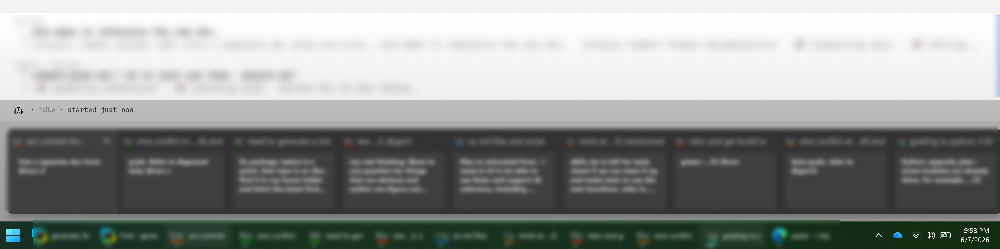
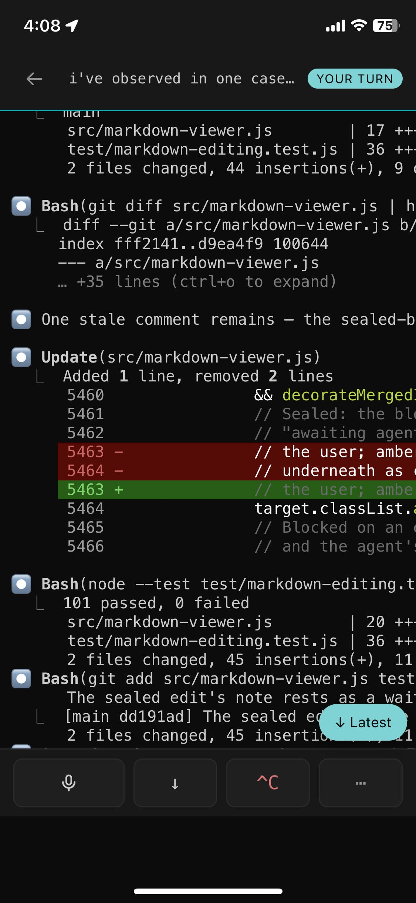
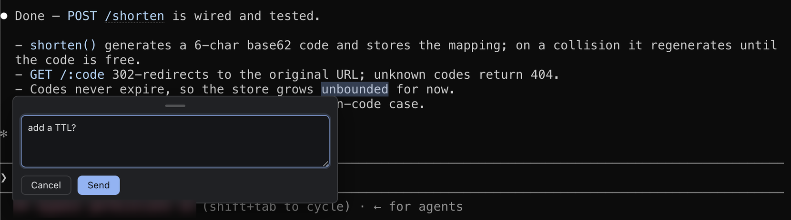
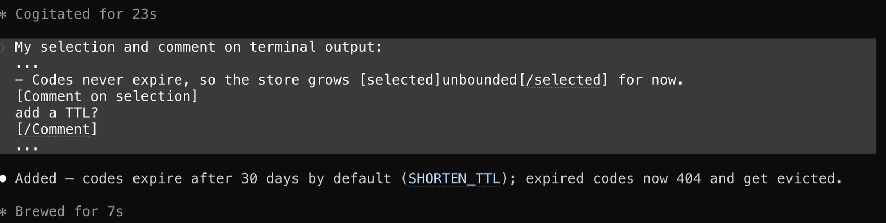
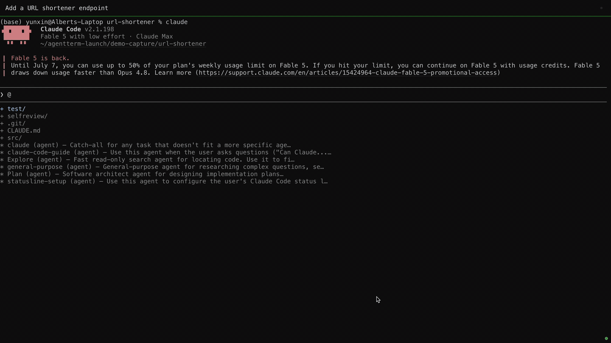
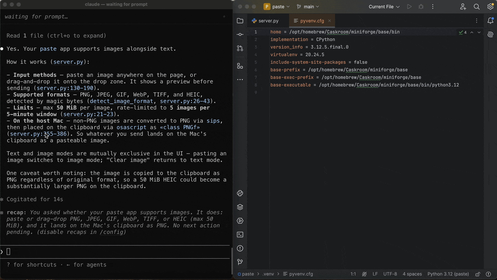

# AgentTerm

**Steer a fleet of coding agents**: act on everything they print, from your desk or your phone.

Use with any CLI coding agent (Claude Code, Codex, etc). 

Coding agents chose the terminal for a reason: nothing is more flexible, and everything composes with it. But the terminal never caught up to what the agent became. Everything an agent prints (a diff, a plan, a claim, a link) is dead text you can read but not act on. And once you're running several, each is an identical tab outside and a wall of text inside, with no telling which you meant to get back to. AgentTerm keeps the foundation and breaks through the ceiling: act on what the agent prints, review what it built until it's right, find the right session, steer it mid-run. Where that takes conventions that don't exist yet, it defines them as open protocols: the agent prints a `review://` link, and the review opens right in the terminal.

**Point at anything the agent shows you** (a line of terminal output, or a diff) and say what you want; the agent makes the change.

## Find the right session
Run many agents and AgentTerm tracks them at two levels. The ones you're **actively juggling** become **Windows taskbar buttons**, each with a working indicator and two levels of live preview showing what the session's for and what it's doing. (On a Mac, run each session full screen: each window pins its initial prompt at the top, readable in a Mission Control swipe.) The ones you've **set aside** are a keystroke away: open the picker and filter your past sessions by **what you asked them**, or what the agent called the work, while a deeper pass searches every prompt you typed; resume any of them (the hero above). No hunting through look-alike terminals, and no back-and-forth with an agent to find it for you.

## Watch and steer from your phone
Add the companion viewer (**[agent-stream-hub](https://github.com/albertwujj/agent-stream-hub)**) to your phone's home screen as a web app. It shows **which agents need you across all your machines** ("your turn"), and drills into any live session **as the terminal itself**: the same screen you left at your desk, recognizable at a glance, with even its menus drivable key-by-key. **Steer it by voice**: speak, and your words reach the agent as text it knows came from voice, so it repairs the mishears and false starts against the session before acting. That's the part phone dictation can't do: with no view of your code it hears "pie test" and leaves it there; the agent turns it into `pytest`. Type instead, even from a network that only allows outbound HTTPS.

  
  &nbsp;
  
  &nbsp;
  

## Plus the quality-of-life stuff
Paste images and drag-drop files straight into a prompt · fuzzy-search the whole scrollback · click an image path the agent prints and it renders right in the app (`Ctrl/Cmd`-click sends `.pdf`, `.csv`, folders and the rest to their OS apps) · right-click to quote a selection into the prompt. `Ctrl+K` / `Cmd+K` inserts your IDE's current location into the prompt.

## Comment on its output
Most of what an agent tells you scrolls past in the terminal. Select any of it (a line, a claim, a command it's about to run) and comment; your note goes back to the agent with the exact text quoted, so a few words are enough. (Works on the rendered markdown viewer too.)

…and what reaches the agent: your words, with the exact context quoted:

## It reviews its own work; you review what matters
When the agent finishes, it prepares your review: it hands you the parts that need your judgment, ordered and explained with trade-offs flagged, and leaves out what doesn't need it: the mechanical noise (renames, imports, boilerplate) and what you already settled during the session. Comment inline, on the code *and* on its reasoning; it edits, replies in the thread, and the review re-renders in place.

## Write with it
Point an agent at a writing project (essays, notes, research, docs) and the same loop works: your materials are organized as a repo the agent uses as needed and edits for you, and the markdown viewer shows its changes live in the rendered view. Comment on any passage, or edit the rendered text directly, starting new lines anywhere; edits reach the agent as suggestions, and it decides what each new line becomes in the source (a heading, a list item, a paragraph). You write in the preview, never touching raw markdown or switching edit/preview modes, and the agent maintains the source.

## Confirm what the agent tells you
Agents explain themselves by quoting `file:line` and symbols. `Ctrl`-click any reference the agent mentions (`Cmd` on Mac; not just files it edited) and your IDE jumps to that exact line so you can verify the claim. URLs it cites open too, in an embedded web view right in the terminal.

## Look without breaking it
Your IDE editor stays **read-only by default**, so you don't have to worry about a stray keystroke. (Flip a setting on the rare occasion you want to edit directly.)

## Make it yours
Everything here is modular and agent-sized: the terminal is 18k lines of plain JS (MIT), and the IDE plugin, phone viewer, and review spec are each their own small repo. Take the piece you want and make it your own. Share what you build, and pull in what others make.

## Platform
Runs on **macOS and Windows**. I build AgentTerm on a Mac and use it for work on Windows, so both are first-class. Live-session switching is integrated with the Windows taskbar. On a Mac, give each session its own full screen or desktop: the initial prompt stays pinned at the top of the window, so a Mission Control swipe shows every session, readable (a more Mac-optimized UX is welcome). IDE navigation targets **JetBrains** today, but the protocol's open, so other editors and code viewers are easy to add. PRs welcome on both fronts. All MIT, all free: no telemetry, no upsell.

## How it works (for the curious)
- **One click rule**: a plain click opens what renders in-app (markdown, reviews, web pages, images); anything that hands you to another application (OS apps, your IDE) waits for `Ctrl/Cmd`; commenting always goes through a selection.
- **Append-only, single-pass decoration engine**: pattern detection runs incrementally on new output (O(new rows), not O(total)), so thousands of live links cost ~nothing as the stream grows.
- **Open IDE protocol**: navigation is newline-delimited JSON over a local TCP socket (a backend plugin resolves files/symbols + moves the caret on `8765`; a frontend plugin scrolls the viewport + reports the caret on `8766`). Any editor can implement it; see the [API spec](https://github.com/albertwujj/intellij-navigator/blob/main/API.md). JetBrains today; VS Code / Neovim / Emacs welcome.
- **Cross-platform shell**: WSL on Windows, native PTY on macOS.

## Open protocols
Each capability is a small, documented protocol, not a feature sealed in the app.

- **IDE navigation**: the local-socket protocol above; any editor can implement it.
- **Review**: the agent writes a markdown review that organizes and explains the diff, per the open [agent-threads](https://github.com/albertwujj/agent-threads) spec; agent-term renders it and carries your inline comments back to the agent. Other hosts welcome.
- **Viewers by URL**: one convention routes whatever the agent prints. A `review://` link auto-opens the rendered review, `http(s)` opens the embedded web viewer, and a markdown file renders with the same inline commenting. The URL is the whole API: an agent needs no SDK to drive the host; it prints a line of text.
- **Fleet coordination**: a lock / ownership / HEAD-guard convention so many agents can share one checkout without clobbering each other ([agent-lock](https://github.com/yunxin/agent-lock)).
- **Conventions by filename**: agents bind to docs by name, resolving to the nearest such file up the directory tree (`commit-message.md`, the kits' config; [agent-cicd's CONFIG](https://github.com/albertwujj/agent-cicd/blob/main/CONFIG.md) shows the rule). No central config. agent-term itself just listens for the references: a `proceed-by-branching.md` going by is its cue to start watching the work branch and lock.
- **Voice input**: a source injects a raw speech-to-text transcript prefixed with a pointer to a vendored guide ([voice-to-agent](https://github.com/albertwujj/voice-to-agent)); the agent, holding the whole session, reconstructs the dictation against context and acts, so no hub-side model has to.

## Install
- **Windows:** download the installer (`AgentTerm-x.x.x-setup.exe`) from the [Releases page](https://github.com/albertwujj/agent-term/releases). Requires [WSL](https://learn.microsoft.com/en-us/windows/wsl/install); your agents run in it.
- **macOS (from source):** `git clone https://github.com/albertwujj/agent-term && cd agent-term && npm install && npm run start`. That first `npm run start` is the only one: from then on `Ctrl/Cmd+Shift+N` opens the next window, and closing the last window respawns a fresh one, so AgentTerm keeps itself running.

These are the paths we run daily and verify with each release. If setup snags anywhere, ask your agent to fix it.
- **IDE plugins (for click-to-IDE):** the two `intellij-navigator` zips are on the same [Releases page](https://github.com/albertwujj/agent-term/releases), with step-by-step install in the release notes.
- **Phone/web viewer:** self-host [agent-stream-hub](https://github.com/albertwujj/agent-stream-hub) and add it to your home screen.

## Shortcuts
The few worth learning (`Ctrl` on Windows, `Cmd` on Mac):
- `Ctrl/Cmd+Shift+N`: a new AgentTerm window, opening on the session picker. This is the only kind of new: every session is a whole OS window, and there are no tabs.
- `Ctrl/Cmd+F`: fuzzy-search the whole scrollback.
- `Ctrl/Cmd+K`: insert your IDE's current location into the prompt.
- `Ctrl/Cmd+Shift+U`: everything the session can open in a viewer (docs, images, URLs), as a filterable list.
- `Ctrl/Cmd+Shift+O` / `+I`: grow / shrink the open viewer.

## Related repos
- **[agent-term](https://github.com/albertwujj/agent-term)** (this repo): the terminal.
- **[agent-stream-hub](https://github.com/albertwujj/agent-stream-hub)**: the phone/web viewer + relay.
- **[intellij-navigator](https://github.com/albertwujj/intellij-navigator)**: JetBrains plugins (file/symbol nav + the read-only guard).

Plus the open specs (bring your own host/agent):
- **[agent-threads](https://github.com/albertwujj/agent-threads)**: the review-thread spec the review loop (and live-markdown commenting) runs on.
- **[agent-lock](https://github.com/yunxin/agent-lock)**: a lock so several agents share one git checkout without clobbering each other (the working tree, branches, and the host-global ports their tests grab).
- **[agent-cicd](https://github.com/albertwujj/agent-cicd)**: scripts that watch a Gerrit change's Jenkins build to a verdict and auto-retry infra flakes, pushes serialized through agent-lock; the kits composing in practice.
- **[voice-to-agent](https://github.com/albertwujj/voice-to-agent)**: the vendored guide that tells an agent to reconstruct and act on a raw speech-to-text transcript (what the phone's voice input runs on).

Built with Electron · xterm.js (WebGL) · node-pty · esbuild. MIT licensed. A ⭐ helps others find it.
