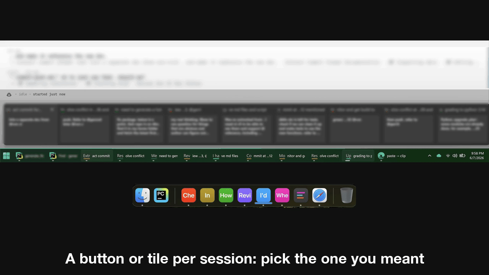

# Grow your own terminal for coding agents

**Jump-start with this repo and its suite.**

## The terminal path

People run coding agents in an IDE, in the terminal, or in the vendor's desktop app. The terminal keeps pulling them in: Claude Code and Codex shipped as terminal programs, and Cursor and Copilot, born in the IDE, added CLIs of their own. A form from decades ago turned out to be a good fit for what an agent needs: text in, text out, and your shell, git, and every other tool you own one command away.

So why do people still run agents in the IDE, and why are the vendors adding their agents to desktop apps? Partly because the standard terminal interface (TUI), although great for text-centric iteration, cannot offer agents and users the essentials and the boosters a richer interface can. One answer is to move the agent out, into an app built around it. The other is to treat the terminal as the core and extend it. This repo is the second path: a full terminal wrapped in a modern extensible window (Electron), retaining everything you already have and raising the ceiling.

What about the vendor desktop apps, which also offer a richer interface? An app built around one vendor's agent trades away some key benefits: the other agents, and the closeness to your shell environment, etc. For coding it can also disorient, adding a workspace of its own between you and the code; many who try it drift back to the terminal, where the familiar, the continuity, the repo, the shell, and the tests already live. The grown terminal here keeps all the goodness, yet offers a lot more.

## Why it holds

This path can look hacky: the host parses text, and reacts to it. But text is the durable seam. An agent's intentions arrive as text through every turn, and good output style persists, so parsers keep working. It holds from both sides: guide files instruct the agents to print what the host understands, and the parser tracks the natural output styles the agents use intuitively. Enhancement is quick when something new shows up. In practice the parsing has grown well, more robust while staying flexible, without being tied to vendor SDKs or APIs.

There is also a benefit over what the vendor CLIs can do alone. A CLI does not own the window, so when Claude Code publishes a design mock it can only print the URL and go around the terminal, opening your browser on it. With a host that reacts, the printed line alone is enough: the viewer opens right in the window, with placement and sizing optimized for the situation.

## Yours to grow

It is yours. The agents, made better by running in this grown terminal, grow it further: when something falls short for you, the symptom is right there with you, and you and your agents are in a good position to evaluate and build the fix. That is also part of the larger point: with coding agents at your disposal, you can quickly grow your own tool to fit your own needs, which you know best. So start your own, use and build upon this repo.

## What's added so far

| In a standard terminal | In this grown terminal |
|---|---|
| Several agents running means identical tabs outside, walls of text inside. | Each session gets its own **[unique taskbar button and preview](docs/sessions.md)** on Windows (a Mission Control swipe on a Mac), so you tell them apart at a glance, and the picker searches instantly, down to every prompt you typed and more. |
| Everything the agent prints (a diff, a plan, a claim, a link) is dead text you can read but not act on. | **[Select any of it and comment](docs/comment.md)**; the agent makes the change. A click opens whatever renders (docs, reviews, images) inside the window; web links open in your browser ([the click rule](docs/clicks.md)). |
| Its plans and docs are raw markdown in an editor. | They render live; you **[write in the rendered page](docs/plan.md)** and the agent maintains the source. |
| Agents sharing a checkout have no awareness of each other: branches move, files change, test ports collide underneath. | Start the task with [one doc reference](https://github.com/yunxin/agent-lock/blob/main/proceed-by-lock-and-branch.md) and the agent **[takes the checkout lock](docs/lock.md)** and cuts a branch before its first edit; a padlock at the top right of each window shows who holds it. |
| The agent finishes a change and you get a wall of diff. | It hands you a **[curated package, rendered for your review](docs/review.md)**; you comment inline, it fixes and replies in place. |
| A long CI run either blocks the session, or outlives the agent's turn and finishes unnoticed. | The agent starts the job and hands the terminal back; **[the job reports its own completion](docs/jobs.md)** through the terminal and the idle agent is prompted to pick it up, surviving session restarts; a runner icon at the top right shows what is running. |
| It sits blocked on a question until you're back at your desk. | **[Your phone shows the same terminal](docs/phone.md)**; unblock it by voice. |
| The agent cites file:line and symbols; checking a claim means finding it by hand. | Ctrl/Cmd-click any reference and **[your IDE jumps to that exact line](docs/ide.md)** to verify the claim, with the editor read-only so a stray key changes nothing. |

## Native to the OS

Why not tmux, or one manager app over every session? This terminal takes the opposite shape: each session is its own OS window and process, the way each agent stands on its own. The OS is the manager you already know, so the taskbar, Mission Control, and alt-tab do the juggling, and each agent, through its terminal host, is instantly recognizable. The sessions still cooperate, through the same open conventions the agents use: the checkout lock, and the sessions log. The phone hub is the one aggregator, and it runs on the side, remotely, never interfering with the OS windows. Independent like the agents, cooperating like the agents; hierarchy, when it helps, lives inside a session, where an agent runs its own subagents.

## How to start

**Run it.** Directly from source. Launch is fast, and you see the result of a source change right away.

1. Clone: `git clone https://github.com/albertwujj/agent-term` (on Windows, into WSL's native filesystem).
2. Install [Node.js](https://nodejs.org) if you don't have it (the [development guide](docs/development.md) covers the Windows setup).
3. From the checkout: `npm ci` once, to install the dependencies, then `npm run start` (`npm run start:wsl` on WSL); or start from your own repo with `--prefix` pointing at the checkout ([sessions](docs/sessions.md)).

The above already covers the top of the table: sessions as windows with their taskbar buttons and picker, and commenting on anything the agent prints.

**Add the loops you want.**

1. **Clone what you need**: each loop is a small repo. [agent-threads](https://github.com/albertwujj/agent-threads) for plans and reviews, [agent-lock](https://github.com/yunxin/agent-lock) for the checkout lock, [agent-jobs](https://github.com/yunxin/agent-jobs) for long runs.
2. **Vendor what you command**: to command the agent with the supported verbs (md files named for the verb; use `@` to pick, say by typing `@produce-r` for producing a review), it's best to vendor agent-lock and agent-threads into your workspace repo. See [placement](docs/conventions.md).
3. Phone: self-host [agent-stream-hub](https://github.com/albertwujj/agent-stream-hub) and add it to your home screen.
4. IDE jump: install the [IntelliJ Navigator plugins](https://github.com/albertwujj/intellij-navigator/releases).

**Grow it.** Fill what you need with your agents, using this terminal itself as a boost.

Built on Electron with xterm.js (the terminal emulator) and node-pty (the shell's pty). MIT.
