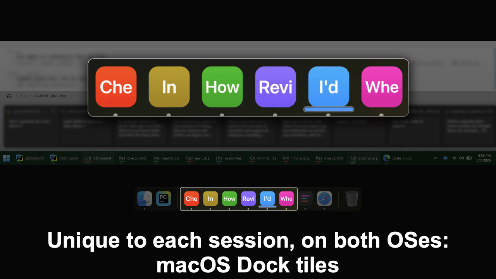
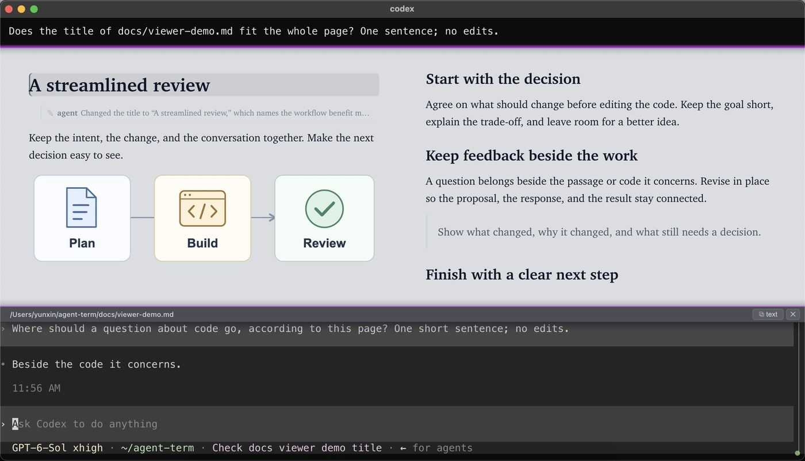

<a name="agentterm"></a>
<a name="agentterm-a-terminal-built-for-coding-agents"></a>
<a name="agentterm-a-super-terminal-for-coding-agents"></a>
<a name="agentterm-a-super-terminal-for-you-and-your-coding-agents"></a>
<a name="agentterm-a-super-terminal-for-you-and-your-agents"></a>
<a name="agentterm-a-greatly-expanded-terminal-for-you-and-your-agents"></a>

# AgentTerm

<a id="demo"></a>

A terminal for AI CLIs, expanding each session into its own rich visual workspace for the new way of working *(autoplays after loading)*:

[](https://raw.githubusercontent.com/albertwujj/agent-term/main/docs/assets/hero-demo-f2b2081d509f.gif)

*View a frame:* [Tell apart 1](https://raw.githubusercontent.com/albertwujj/agent-term/main/docs/assets/frames/sessions-1.png?v=79f36ffbdc56) · [Tell apart 2](https://raw.githubusercontent.com/albertwujj/agent-term/main/docs/assets/frames/sessions-2.png?v=10025b4964c5) · [Resume](https://raw.githubusercontent.com/albertwujj/agent-term/main/docs/assets/frames/resume.png) · [Comment](https://raw.githubusercontent.com/albertwujj/agent-term/main/docs/assets/frames/comment.png) · [Docs 1](https://raw.githubusercontent.com/albertwujj/agent-term/main/docs/assets/frames/docs-1.png) · [Docs 2](https://raw.githubusercontent.com/albertwujj/agent-term/main/docs/assets/frames/docs-2.png) · [Docs 3](https://raw.githubusercontent.com/albertwujj/agent-term/main/docs/assets/frames/docs-3.png) · [Code 1](https://raw.githubusercontent.com/albertwujj/agent-term/main/docs/assets/frames/code-1.png) · [Code 2](https://raw.githubusercontent.com/albertwujj/agent-term/main/docs/assets/frames/code-2.png) · [Code 3](https://raw.githubusercontent.com/albertwujj/agent-term/main/docs/assets/frames/code-3.png) · [Phone 1](https://raw.githubusercontent.com/albertwujj/agent-term/main/docs/assets/frames/phone-1-e58c3dbfe6c6.png) · [Phone 2](https://raw.githubusercontent.com/albertwujj/agent-term/main/docs/assets/frames/phone-2-1266e3d01d5d.png).

*Dive deeper:* [Tell apart](docs/sessions.md#switch-to-the-right-running-session) · [Resume](docs/sessions.md#find-and-resume-sessions) · [Comment](docs/comment.md) · [Docs](docs/plan.md) · [Code](docs/review.md) · [Phone](docs/phone.md).

<a name="quick-start"></a>

**Quick start:** ask your agent. macOS, or Windows through WSL.

Check first? Read the [setup steps](docs/setup.md) and [what AgentTerm touches](SECURITY.md#what-agentterm-touches).

Copy this prompt:

```text
Clone https://github.com/albertwujj/agent-term to ~/agent-term.
Follow the recommended setup in its docs/setup.md for my current
project, then launch AgentTerm there.
```

Phone access, including recording and transcription, and IDE integration have [separate setup](docs/setup.md#phone-and-ide-integration).

Once a window opens, [resume your previous session](docs/sessions.md#resume-an-existing-cli-session) or [start a new one](docs/sessions.md#start-an-agent), and work as usual. Explore the additions shown in the [demo above](#demo), and follow the [guides below](#where-to-go-next) to start using them.

<a name="why-extend-the-terminal"></a>

## Why expand the terminal

If you are a terminal fan and want to get straight to it, skip ahead to [what AgentTerm adds](#whats-added-so-far).

The terminal is a natural home for coding agents: text in, text out, with the shell, git, and other tools one command away. Claude Code and Codex started there; Cursor and Copilot added CLIs alongside their IDE interfaces.

An IDE or desktop app offers richer views and interactions than a text interface alone. Expanding the terminal lets AgentTerm add those capabilities while keeping your existing AI CLIs in the familiar text interface.

As agents take on more implementation, traditional IDE functions take a back seat, and your energy and focus shift toward plans, reviews, and managing several sessions at once. The expanded terminal supports that work visually, like an IDE: plans and reviews render in the window, where you direct the agents right on the page.

Richer views appear when needed, and the window returns to the terminal view when you finish. Persistent panels can compete with the session for your attention. Here the window is dedicated to your session, shaped by your work, and full screen if you like, with nothing else in view ([one OS window per session](#one-os-window-per-session)).

<p align="center">
<a href="https://raw.githubusercontent.com/albertwujj/agent-term/main/docs/assets/viewer-window.gif"></a>
<br><strong>Work on a document right in the terminal.</strong> The document area expands in full and closes as your focus shifts.
</p>

A vendor's desktop app moves the conversation out of the terminal and into an interface built around its own agent and workflow. With AgentTerm, you keep your choice of AI CLIs in the terminal's familiar text interface.

Some terminals combine support for AI CLIs with an agent and platform of their own. AgentTerm's whole purpose is to make your existing AI CLIs work better for you.

### One OS window per session

Why not tmux, or one manager app over every session? The OS already provides familiar, mature tools for arranging and switching windows: the taskbar, Dock, Mission Control, and alt-tab. Giving each session its own window and process lets AgentTerm build on those strengths and add what agent sessions need. Each session has a distinct visual signature to help you recognize it. To reduce clutter, AgentTerm hides sessions you don't need for a while; the [session picker](docs/sessions.md) brings them back.

### A stable interface between agent and terminal

This path can look hacky: the host parses text and reacts to it. Useful text conventions tend to persist, and in practice the patterns we rely on have held up well. We occasionally add support for new patterns, and those updates have been among the easier parts to maintain. It works from both sides: guide files instruct agents to print what the host understands, and the parser recognizes output styles agents already use. This integration does not require a vendor SDK or API.

With a host that understands its agents, and agents that understand the host, an agent can use capabilities beyond those built into its CLI. For example, a plan the agent mentions can open inside the same window, rendered for you to read and write on. Through its protocol with the host, the agent treats what you write as intent and updates the plan in place.

<a name="make-it-fit"></a>

### Extend it further

You and your agents can change and extend this terminal, down to its code, to fit your work and your team's.

Use it and explore first; what you need may already be there. When you find something is indeed missing while you work, you are best placed to evaluate and fill the gap, with the scenario right in front of you.

This terminal makes that quick: it is already a better tool for working with your agents, including the work to fix itself. Change its source, and every window opened afterward picks up your improvement.

## What's added so far

Below are just examples. Follow the links to explore more features.

| Plain terminal | AgentTerm |
|---|---|
| **Sessions**<br>hard to tell apart | Each session has its own OS window, with a **[unique taskbar button or Dock tile](docs/sessions.md#switch-to-the-right-running-session)** (a preview on Windows, the session title on macOS), so you tell them apart at a glance. |
| **Resume**<br>hard to find | **[Type a few letters to find and resume a closed session](docs/sessions.md#find-and-resume-sessions)**; the picker searches your prompts and session titles to help you return to the session. |
| **Comment**<br>manually quote past output | **[Select anything the agent prints and comment](docs/comment.md)**. |
| **Docs**<br>append-only, not rendered | Ask for a plan as a markdown file and click its name. The doc opens rendered, and the rendered page is where you work: **[comment on any passage, or write in it directly](docs/plan.md)**; the agent replies in a thread on the passage, discusses your feedback when needed, and updates the document to reflect your intent. AgentTerm shows what you proposed and what the agent changed. |
| **Code**<br>scrolling fragments, or a wall of diff | The agent hands you a **[curated review, rendered](docs/review.md)**, with a narrative you can follow and the parts that need your attention called out; you comment inline, it fixes and replies in place. |
| **Phone**<br>not connected, travel back to check | **[See which agents need you across your machines](docs/phone.md)**. Open the same terminal on your phone, with the same layout so you recognize at once what you left behind; reply by voice. |
| **Copy**<br>every paste needs cleanup | Copy what the agent wrote and it **[pastes into a chat or email ready to send](docs/copy.md)**, one clean paragraph instead of chopped lines. A doc in the viewer copies the same way. |
| **View**<br>can't click a file name to see it | Click a file the agent mentions (a doc, an image, a video, a PDF) and **[see it right in the window](docs/viewer.md)**, above your prompt; it gets out of the way as your focus shifts. |
| **Shared checkout** collisions<br>test ports, even with worktrees | Type one `@` mention (`@proceed-b` completes to the guide doc's path) and the agent **[takes the checkout lock](docs/lock.md)** and cuts a branch before its first edit; a padlock at the top right of each window shows who holds it. |
| **Long jobs**<br>unresponsive, or a missed finish | The agent starts a CI run or other long job and hands the terminal back; **[the job reports its own completion](docs/jobs.md)** through the terminal and the idle agent is prompted to pick it up, even across a session restart; a runner icon at the top right shows what is running. |
| Not an **IDE**<br>can't jump from a cited symbol or line to the code | Click any file:line or symbol the agent cites and **[your IDE jumps to that exact line](docs/ide.md)** after a brief pause for selection; Ctrl/Cmd-click jumps immediately. The editor stays read-only so a stray key changes nothing. |

## How it works

AgentTerm runs your existing AI CLI in a full terminal, using Electron for the window, xterm.js for terminal emulation, and node-pty for the shell connection. The host parses terminal output for file references and recognized conventions, and keeps track of mentioned documents even when the CLI redraws the screen.

Those references connect the conversation to host capabilities. A Markdown path identifies a document the host can render. A `review://` reference can trigger validation, rendering, and automatic opening of a review. Document viewing and review build on this mechanism. Guide files tell agents how to follow these conventions. For example, [agent-threads](https://github.com/albertwujj/agent-threads) provides the guides and file protocol for document and review feedback.

To keep the terminal responsive, repeated scans are combined and scheduled, while file checks and review rendering run asynchronously.

## Where to go next

The [quick start](#quick-start) sets up the terminal together with [plans](docs/plan.md), [reviews](docs/review.md), the [checkout lock](docs/lock.md), [long jobs](docs/jobs.md), and the voice interpretation guide. [Sessions started before you switched to AgentTerm](docs/sessions.md) work too.

Follow the [suite guides](docs/suite.md#using-the-components) to start using them. For example, ask your agent for a curated review with `@produce-r`, which completes to [produce-review.md](https://github.com/albertwujj/agent-threads/blob/main/code/produce-review.md). The agent curates and presents the changes for you to review and comment on.

Add [phone access](docs/phone.md) when you want to continue remotely, or [IDE integration](docs/ide.md) if you use an IDE. These have separate setup; phone voice input also needs recording and transcription configured on the hub.

**Try a change** with your agents. The next window you open picks it up, since every window starts from the latest source ([how a window opens](docs/sessions.md)).

MIT licensed. [No telemetry, no account](SECURITY.md#what-agentterm-touches).
