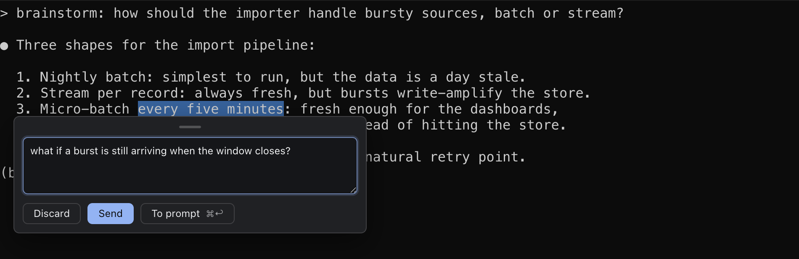
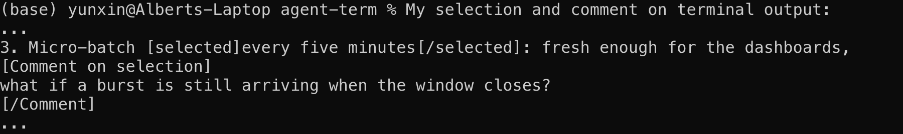

# Comment on the agent's output

Most of what an agent tells you scrolls past in the terminal (`Ctrl/Cmd+F` fuzzy-searches the whole scrollback). Select any of it (a line, a claim, a command it is about to run) and comment; your note goes back to the agent with the exact text quoted, so a few words are enough. It works the same on the rendered markdown viewer.

…and what reaches the agent: your words, with the exact context quoted:

A click opens whatever the agent prints that renders (docs, reviews, images) in a viewer inside the window; a web link opens in your browser. The full rule, with the IDE and OS handoffs and the viewer shortcuts: [what a click does](clicks.md).

If your CLI captures the mouse (Claude Code's fullscreen rendering does), hold `Shift` while selecting; commenting works the same. To keep plain-drag selection (without holding `Shift`), launch Claude Code with `CLAUDE_CODE_DISABLE_MOUSE=1`, or `CLAUDE_CODE_DISABLE_MOUSE_CLICKS=1` to keep its wheel scrolling.
