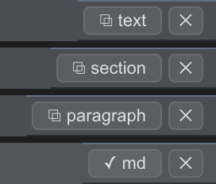

# Copy a doc into a message

A plan or a draft written in the viewer often ends up as a message: a Teams post, an email, a reply on GitHub. The `⧉` button at the right of the viewer's bottom bar copies it in the form the destination needs, so nothing needs to be retyped or cleaned up on the other side. Your comments and unsent edits live beside the doc and stay behind, whichever copy you take.

**Plain text, for Teams or email.** The plain click copies text only: headings drop out, each paragraph becomes one line, list items stay one per line, code keeps its line breaks, and a blank line separates the blocks.

**Copy takes what you have clicked.** With nothing clicked, the button reads `⧉ text` and copies the whole doc. Click a heading first and it reads `⧉ section`: the copy is the body under that heading, up to the next heading of the same level, sub-sections included. Click a paragraph, a list, or a code block and the button names it and copies just that block. The button's label, in the viewer's bottom bar, is the preview: read it, then click.

Besides copying, the click also arms the block for a comment or an edit ([plan](plan.md)): type a letter or a digit after copying and you are commenting on the same block. `Esc` or a click elsewhere clears it. `Ctrl/Cmd+C` with a block clicked copies the same thing, as normal, so with a heading clicked it copies the section under it, exactly as the button does.

**Markdown, for GitHub or Reddit.** `Ctrl/Cmd`-click the button (`Alt` works too) to copy the markdown source of the same scope, for a surface that renders markdown itself. The flash on the button says which copy fired: `✓` for text, `✓ md` for source.

**From the terminal.** What the agent prints in the terminal is laid out for the terminal: prose wrapped at the column width, a mark at the start of each message, borders around a boxed prompt. Select the passage and press `Ctrl/Cmd+Shift+C` to copy it as message text: the marks and borders drop out, each paragraph becomes one line, list items stay one per line, and punctuation, paths, and `file:line` references stay as printed. `Ctrl/Cmd+C` copies the selection as it appears on screen, the copy to take for code. The pill under a selection names the chord beside `Type to comment`.
