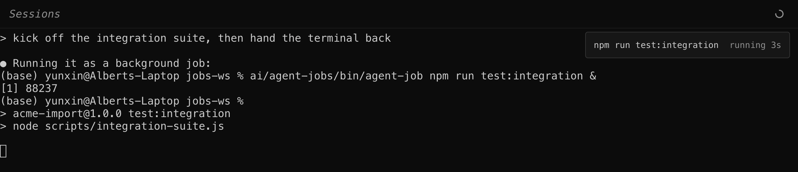
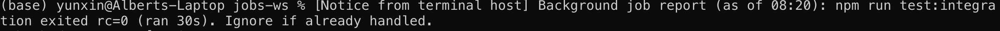

# Long jobs

A long run the agent starts (CI, a heavy test suite, a deploy) leaves a standard session with two bad options: the agent either sits watching it, blocking the terminal, or ends its turn and the finish arrives to nobody, the result sitting unhandled until you notice.

[agent-jobs](https://github.com/yunxin/agent-jobs) is the convention that fixes this. Point the agent at your clone of it and it works out the rest: it runs the job under `agent-job`, ends its turn without stopping the work, and hands the terminal back to you. The job reports its own completion, per agent-term's [job-events.md](job-events.md) contract, and when it finishes and the agent has been idle since, the terminal prompts the agent to pick the result up:

To make it automatic, bake the convention into the project's guide file, a [verb doc](conventions.md) of your own, or a skill that wraps `agent-job`, such as a CI skill, so no prompt has to mention it.

The records survive a session restart or resume, so a job outlives the session that started it.

A runner icon at the top right of the window shows the running jobs; click it for the list.
