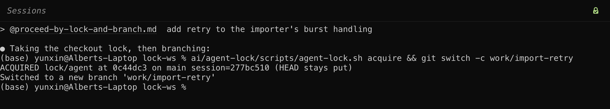

# The checkout lock

Several agents sharing one checkout step on each other: HEAD and the working tree move underneath, and heavy local tests bind host-global resources such as ports, so runs collide. `git worktree` splits the working tree but not those resources, and parallel worktrees are harder to track.

[agent-lock](https://github.com/yunxin/agent-lock) is the convention that serializes this. Start a task by referencing [proceed-by-lock-and-branch.md](https://github.com/yunxin/agent-lock/blob/main/proceed-by-lock-and-branch.md) in the prompt: the agent takes the lock, cuts a fresh `work/<slug>` branch off the latest remote tip, and only then edits, releasing the lock when its resource-using phase is done. The lock's own scripts refuse a colliding step, so safety does not depend on agents being polite. Its clean-tree guards tolerate untracked files under `ai/` by default (`SCRATCH_DIR`; set it empty for a strict check), so the vendored suite needs no configuration. A second verb doc, [borrow-lock.md](https://github.com/yunxin/agent-lock/blob/main/borrow-lock.md), covers taking over the checkout from a holder that is parked.

The terminal shows who holds the checkout as a padlock at the top right of each window: green with a check when this window holds it.
