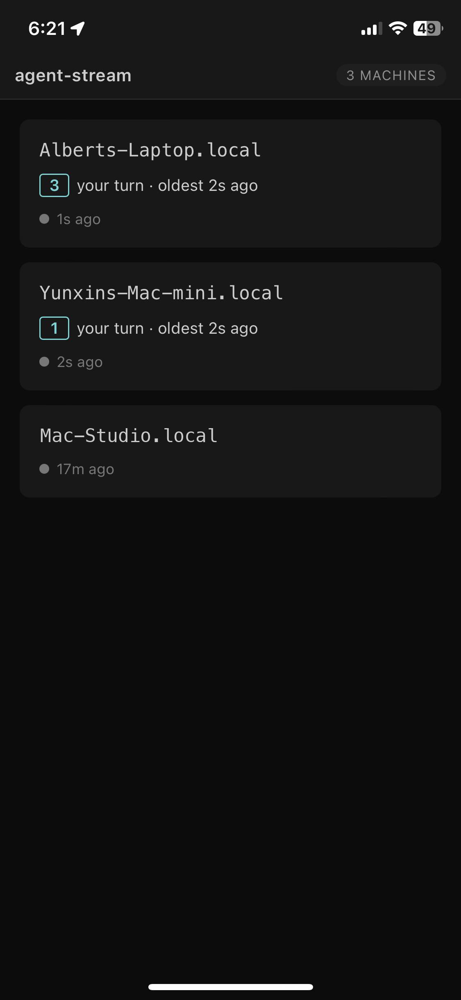
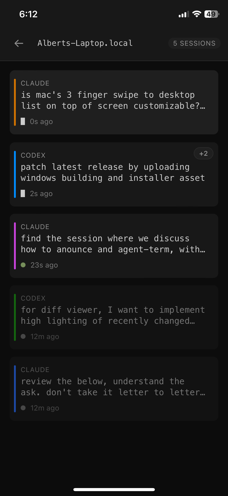

# Watch and steer from your phone

  
  &nbsp;
  
  &nbsp;
  

Add the companion viewer ([agent-stream-hub](https://github.com/albertwujj/agent-stream-hub)) to your phone's home screen as a web app. It shows which agents need you across all your machines ("your turn"), and drills into any live session as the terminal itself: the same screen you left at your desk, recognizable at a glance, with even its menus drivable key-by-key.

Unblock it by voice: speak, and your words reach the agent as text with a reference to instructions, so it repairs the false transcriptions using the session context before acting. That's the part phone dictation can't do: with no view of your code it hears "pie test" and leaves it there; the agent turns it into `pytest`. Type instead when voice isn't right. Each transcript arrives prefixed with a pointer to [voice-to-agent](https://github.com/albertwujj/voice-to-agent)'s `interpret.md`, the instruction doc that tells the agent to do exactly this.

The viewer is self-hosted and opt-in: you run the relay on a machine you own, and everything travels over plain outbound HTTPS, requiring no inbound ports or VPN.
