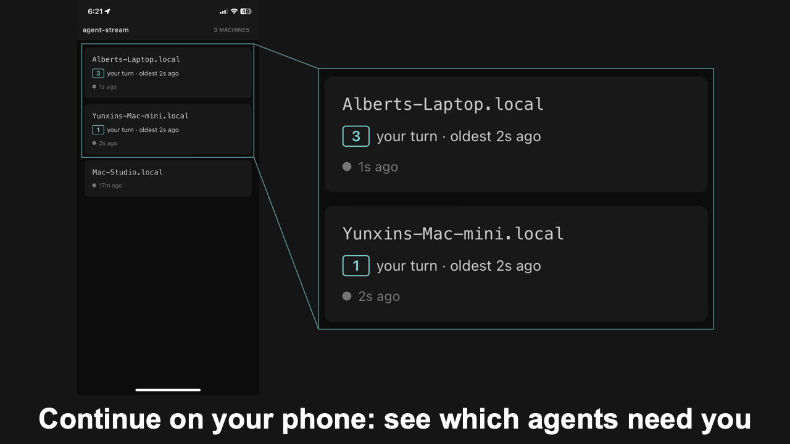
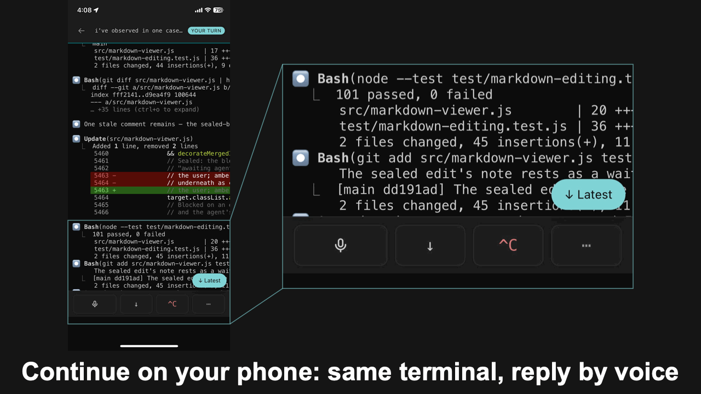

# Watch and steer from your phone



Add the phone view ([agent-stream-hub](https://github.com/albertwujj/agent-stream-hub)) to your phone's home screen as a web app. It shows which agents need you across all your machines ("your turn"), and drills into any live session as the terminal itself: the same screen you left at your desk, recognizable at a glance, with even its menus drivable key-by-key. A laptop works similarly, in a layout adjusted to its screen, showing the sessions the desktop runs.

<details>
<summary>The sessions on one machine</summary>
<p align="center">

</p>
</details>

## Reply from the same terminal



Unblock it by voice: speak, and your words reach the agent as text with a reference to [instructions](https://github.com/albertwujj/voice-to-agent/blob/main/interpret.md), so it repairs the false transcriptions using the session context before acting. That's the part phone dictation can't do: with no view of your code it hears "pie test" and leaves it there; the agent turns it into `pytest`. Type instead when voice isn't right.

## Setup

The phone view is self-hosted and opt-in: you run the relay on a machine you own, and everything travels over plain outbound HTTPS, requiring no inbound ports or VPN. Once the relay runs, point this terminal at it: its URL goes in `~/.agent-term/config.json`, and the next window streams. Ask your agent:

```text
Point this terminal at my hub at <url> for remote use, following
docs/phone.md in ~/agent-term.
```
