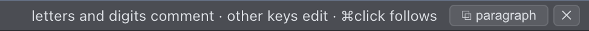

# Plan with it

Ask your agent to write the plan to a markdown file, then click the path it prints, and the doc opens rendered in the viewer above the prompt ([what a click does](clicks.md)). The viewer turns markdown into a place you write English. A doc opens rendered and shows both your proposals and how the agent applies them: you [comment on any passage](comment.md) or edit the rendered text directly, and the agent processes and polishes. You write in the preview, never touching raw markdown or switching edit/preview modes, and the agent maintains the source.

Click anywhere, and the bottom bar tells you which keys comment, which keys edit, and, on a link, how to follow it.

It reads as a book: two pages side by side, short lines. Pages turn rather than scroll.

English is where the real planning happens: much of a design is settled in words before any code. A plan converges here the way code does: commented, revised in place, settled before anything is final.

The same loop is a writing aid in its own right. Anything you write in a repo works the same way, an essay, notes, research, a post: you write on the rendered page and comment on any passage, the agent edits the source and answers in place, and the copy button takes the draft out when it is ready.

Editing goes beyond word swaps: start new lines anywhere in the rendered page, and the agent decides what each becomes in the source (a heading, a list item, a paragraph).

You can also see what the agent changed. A bar in the margin marks each block it edited. Hover one and the exact words show, green for added text and blue beside a deletion, which is what you want when the block is long and only a few words changed. The bars fade over your next few sends.

When a draft is ready to go out, one button copies it, or just the section under a heading, as plain text for Teams or email, or as markdown for GitHub ([copy a doc into a message](copy.md)).

The loop runs on [agent-threads](https://github.com/albertwujj/agent-threads)'s instruction docs (`md/user-intent.md` and the shared `contract.md`); the terminal points the agent at them with each send. Where the clone can live: [placement](conventions.md#placement).
