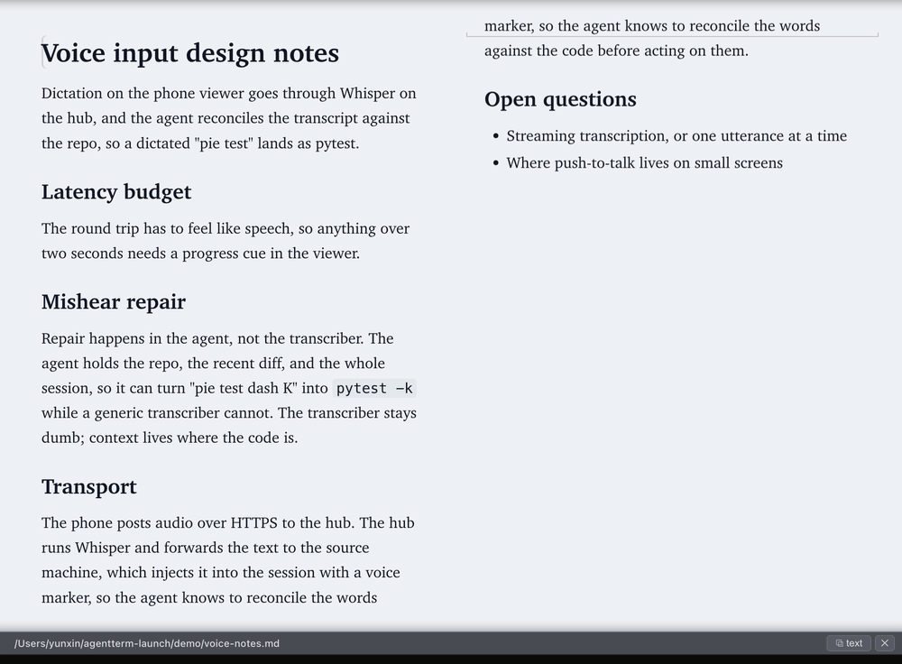
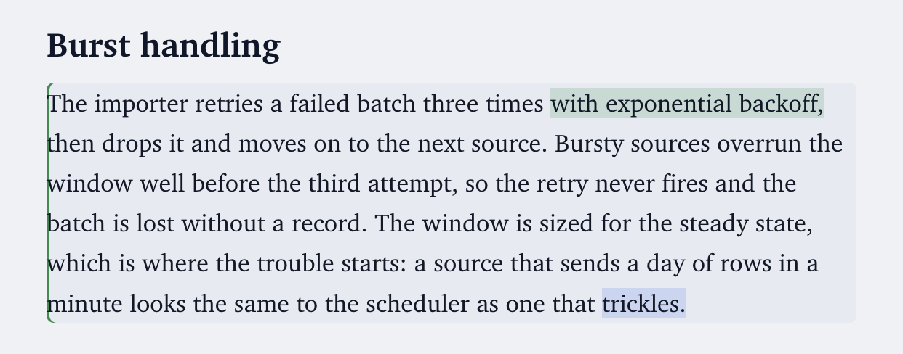

# Plan with it

The viewer turns markdown into a place you write English. A doc opens rendered and shows both your proposals and how the agent takes them forward: you comment on any passage or edit the rendered text directly, and the agent processes and polishes. You write in the preview, never touching raw markdown or switching edit/preview modes, and the agent maintains the source.

And English is where the real planning happens: much of a design is settled in words before any code. A plan converges here the way code does: commented, revised in place, settled before anything is built. The same loop covers any writing project (essays, notes, research), with your materials organized as a repo the agent edits for you.

Editing goes beyond word swaps: start new lines anywhere in the rendered page, and the agent decides what each becomes in the source (a heading, a list item, a paragraph). Your edits reach it as suggestions; it applies the intent.

You also see what came back. A block the agent edits pulses as the change lands, then settles into a thin bar in the margin, so a long doc says where it was touched without shouting. Hover a marked block and the exact words appear: green where text was written, blue on the survivor beside a deletion, since deleted text has nowhere to sit. The two marks answer different questions. The bar says which block, and the hover says which part of it, which is what you want when the block runs six lines and three words moved.

The bars age on your sends rather than on the clock. What changed since your last send reads strongest, one send back is paler, two fainter still, and older changes drop off. Every write the agent makes between two of your sends stays at full strength, so a burst of edits cannot push its own first change out of sight before you have looked at it.

When a draft is ready to go out, one button copies it, or just the section under a heading, as plain text for Teams or email, or as markdown for GitHub ([copy a doc into a message](copy.md)).

The loop runs on [agent-threads](https://github.com/albertwujj/agent-threads)'s instruction docs (`md/user-intent.md` and the shared `contract.md`); the terminal points the agent at them with each send. Where the clone can live: [placement](conventions.md#placement).
