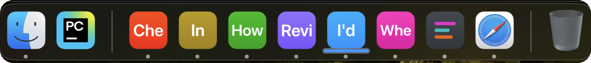

# Sessions

Every session is a whole OS window; there are no tabs.

**Starting an agent.** Type the CLI's command (`claude`, `codex`, whichever you run) and press Return. From that point on, the AI CLI runs in a real shell, just like in any other terminal.

**Codex conversation titles.** Starting or resuming Codex from the picker passes `-c 'tui.terminal_title=["app-name","thread"]'`, so Codex names the conversation in the terminal title. For a `codex` you type yourself, set `terminal_title = ["app-name", "thread"]` under `[tui]` in your Codex configuration. Its default project title and unnamed-thread IDs are not conversation names, so the session shows your first prompt until a name arrives. Claude Code and Cursor need no setting.

**Picking up an existing session from before this terminal.** Start the CLI as above, as a new session, and resume the existing one normally in the CLI; the first prompt after the resume becomes the session's initial prompt, and the rest is the same.

 Session content blurred; the taskbar labels are as they render.

 On a Mac: one Dock tile per session, among the other apps.

**The sessions you are juggling.** On Windows each sits in the taskbar as its own button, generated from the session's initial prompt: the label never changes, so you can memorize it, and its color is locked to the session, distinct and calm. The button carries a working indicator and a preview showing what the session is for and what it is doing, to help you recognize and pick it.

On a Mac each session is its own Dock tile, in the session's color with the first letters of its initial prompt, and a bar beneath it while the agent is working. A tile like "I'd" looks thin at first, but color and letters together become familiar within a few uses, the way an app icon does. Cmd-Tab shows the same tiles, and if you run each session full screen, a Mission Control swipe shows every session, readable, its initial prompt pinned at the top.

**The sessions you set aside.** Right-click the taskbar button or the Dock tile and choose Start or resume session, or press Ctrl/Cmd+Shift+N while an AgentTerm window is in front. Either opens a new window with the picker, which names its start directory above the input and lists your past sessions, the most recent preselected. Filter them as you type, by your prompts and the agent's own titles; resume any of them, run what you typed as a shell command, or press Esc for a plain shell.

**Type `npm run start` (`start:wsl` on WSL) from your agent-term clone once.** Three ways a window comes to be, and where each starts:

| Window | How it opens | Starts in |
|---|---|---|
| The first | `npm run start` (`start:wsl` on WSL; from any directory, with `--prefix` pointing to the agent-term source) | the directory you ran npm in |
| Another | right-click a taskbar button or Dock tile, or `Ctrl/Cmd+Shift+N` with an AgentTerm window in front | the directory the current session's agent was started in; before a first prompt, the window's own start directory |
| After the last closes | spawned automatically, so you only need to run npm once | the same rule, from the window that closed |

- Every new window picks up the latest source from your agent-term clone.
- The picker shows the directory. If it is not the one you want, `cd` there and type the AI CLI's name.
- To quit for good instead of getting a fresh window, type `exit`. Like `cd` and the CLI's name, it is just a shell command.
