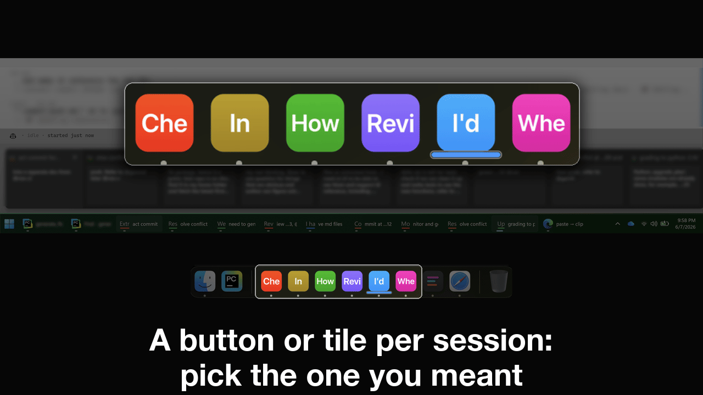
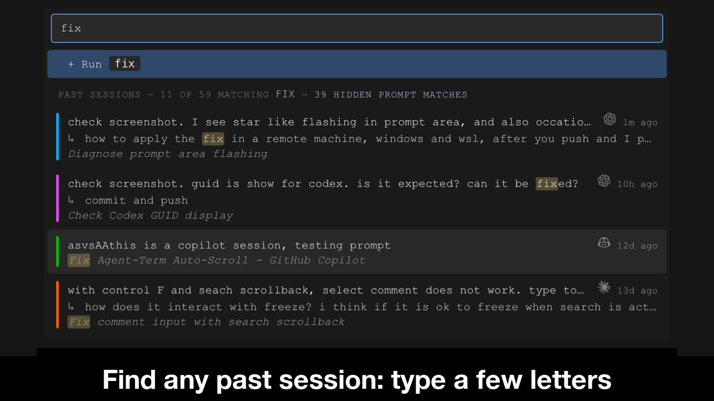

# Sessions

Every session is a whole OS window; there are no tabs.

## Start or resume a session

 <strong>Find any past session: type a few letters. Or start a new one.</strong>

Right-click a taskbar button or Dock tile and choose Start or resume session, or press Ctrl/Cmd+Shift+N with an AgentTerm window in front. A new window opens with the picker: your past sessions, filtered as you type by your prompts and the agents' own titles. Resume one, start a new one (with options, if you want them), or drop to a plain shell.

**Starting an agent.** Type the CLI's command (`claude`, `codex`, or another) and press Return. From then on the AI CLI runs in a real shell, as in any other terminal.

**Picking up a session from before this terminal.** Start the CLI as a new session and resume the existing one inside it; the first prompt after the resume becomes the terminal session's initial prompt.

## Switch to the right running session

On Windows each is its own taskbar button, labeled from the session's initial prompt in a color locked to the session, with a working indicator and a live preview of what it is doing. On a Mac each is its own Dock tile, in the session's color with the first letters of its initial prompt, and a bar beneath it while the agent works; right-click a tile for the session's name. A tile like "I'd" looks thin at first, but color and letters become familiar within a few uses, the way an app icon does. Run each session full screen and a Mission Control swipe shows every session at once, its initial prompt pinned at the top.

## Find and resume sessions

See the [full picker demo](#start-or-resume-a-session).

## Bootstrap

**Type `npm run start` (`start:wsl` on WSL) once, from the directory you want the terminal to open in.** Three ways a window comes to be, and where each starts:

| Window | How it opens | Starts in |
|---|---|---|
| The first | `npm run start` (`start:wsl` on WSL; from any directory, with `--prefix` pointing to the agent-term source) | the directory you ran npm in |
| Another | right-click a taskbar button or Dock tile, or `Ctrl/Cmd+Shift+N` with an AgentTerm window in front | the directory the current session's agent was started in; before a first prompt, the window's own start directory |
| After the last closes | spawned automatically | the same rule, from the window that closed |

- Every new window picks up the latest source from your agent-term clone; a build that fails stops that launch rather than running stale bundles.
- If the picker's directory is not the one you want, `cd` there, then start the CLI.
- To quit for good instead of getting a fresh window, type `exit`. Like `cd` and the CLI's name, it is just a shell command.
