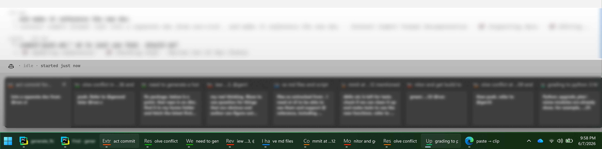
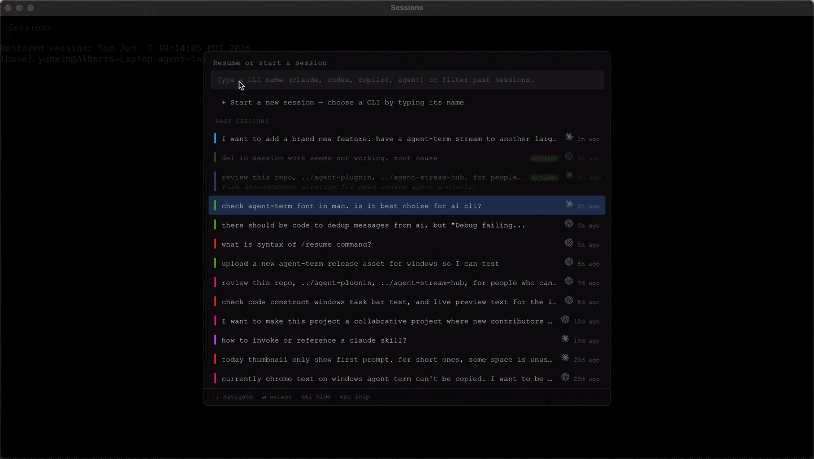

# Sessions

Every session is a whole OS window; there are no tabs.

**Starting an agent.** Type the CLI's command (`claude`, `codex`, whichever you run) and press Return. From that point on, the AI CLI runs in a real shell, just like in any other terminal.

**Picking up an existing session from before this terminal.** Sessions started in another terminal live in the CLI's own store. Start the CLI as above, as a new session, and resume the existing one normally in the CLI; capture starts with the first prompt after the resume, and the rest is the same as for a session started here.

Session content blurred; the taskbar labels are as they render.

**The sessions you are juggling.** On Windows each sits in the taskbar as its own button, generated from the session's initial prompt: the label never changes, so you can memorize it, and its color is locked to the session, lively yet steady, for recognition at a glance. The button carries a working indicator and a preview showing what the session is for and what it is doing, so you grab the one that needs you. On a Mac, run each session full screen: a Mission Control swipe shows every session, readable, its initial prompt pinned at the top.

**The sessions you set aside.** A keystroke opens a new window on the picker, which names its start directory above the input and lists your past sessions, the most recent preselected. Filter them as you type, by what you asked them or what the agent called the work, with a deeper pass searching every prompt you typed; resume any of them, run what you typed as a shell command, or press Esc for a plain shell. No hunting through look-alike terminals.

**Type `npm run start` (`start:wsl` on WSL) from the source enlistment once.** Three ways a window comes to be, and where each starts:

| Window | How it opens | Starts in |
|---|---|---|
| The first | `npm run start` (`start:wsl` on WSL; from any directory, with `--prefix` pointing to the agent-term source) | the directory you ran npm in |
| Another | `Ctrl/Cmd+Shift+N` | the directory the current session's agent was started in; before a first prompt, the window's own start directory |
| After the last closes | spawned automatically, so you only need to run npm once | the same rule, from the window that closed |

- Every new window picks up the latest source from your agent-term enlistment.
- The picker shows the directory. If it is not the one you want, `cd` there and type the AI CLI's name.
- To quit for good instead of getting a fresh window, type `exit`. Like `cd` and the CLI's name, it is just a shell command.
